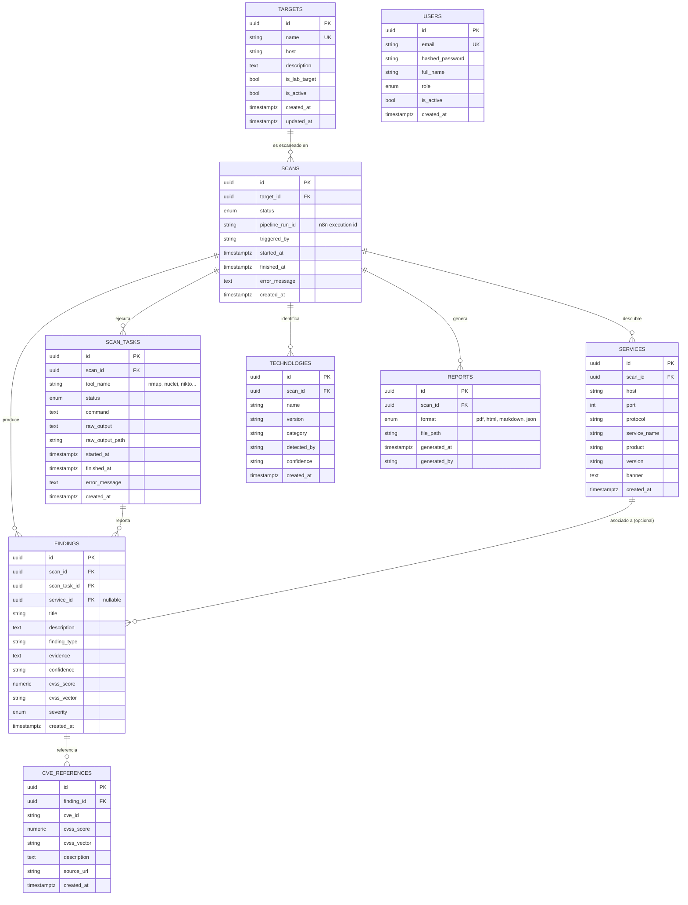

# Modelo de datos

Esquema de PostgreSQL que persiste todo el ciclo de vida de un análisis:
target registrado → ejecución del pipeline → tareas por herramienta →
servicios/tecnologías detectados → hallazgos normalizados → CVEs asociados →
reportes generados. Definido en [`database/models/`](../database/models) y
versionado con Alembic en [`database/migrations/`](../database/migrations).

## Diagrama entidad-relación

`USERS` no tiene FK hacia el resto del esquema todavía: es un placeholder
(Módulo 1) para una futura capa de autenticación multiusuario y no lo
consume ningún servicio en esta etapa del proyecto.

## Descripción de cada tabla

| Tabla | Responsabilidad |
|---|---|
| `targets` | Sistemas registrados para análisis. `is_lab_target` es el flag que el Backend (Módulo 3) usa para aplicar la whitelist: solo se pueden escanear targets del laboratorio local. |
| `scans` | Una ejecución del pipeline de 12 etapas sobre un target. `pipeline_run_id` correlaciona la fila con la ejecución de n8n que la origina. |
| `scan_tasks` | Una invocación de una herramienta concreta (Nmap, Nuclei, Nikto, WhatWeb, ZAP...) dentro de un scan. `tool_name` es texto libre, no enum, para poder sumar herramientas nuevas sin migración. |
| `services` | Puertos/servicios de red descubiertos durante el reconocimiento (Nmap). |
| `technologies` | Stack tecnológico fingerprinteado (WhatWeb u otra herramienta). Alimenta la etapa de "selección inteligente de herramientas" del pipeline. |
| `findings` | Hallazgo normalizado: forma común a la que se traduce la salida de cualquier herramienta antes de persistir. `finding_type` también es texto libre por el mismo motivo que `tool_name`. |
| `cve_references` | CVEs asociados a un finding (relación 0..N, un finding puede tener varios CVEs). |
| `reports` | Metadatos de un reporte generado (PDF/HTML/Markdown/JSON); el archivo en sí vive en el volumen `reports-data`. |
| `users` | Placeholder para autenticación multiusuario futura. |

## Decisiones de diseño

- **UUID como clave primaria** (`gen_random_uuid()`, nativo desde PostgreSQL 13+, sin necesidad de extensión) en vez de enteros autoincrementales, para no filtrar el volumen de filas a través de la API.
- **Enums nativos de PostgreSQL** solo para vocabularios cerrados y estables: `scan_status`, `scan_task_status`, `severity_level`, `report_format`, `user_role`. Todo lo que necesita poder ampliarse sin tocar el esquema (`tool_name`, `finding_type`) es un `string` indexado.
- **`cve_references` como tabla propia** en vez de una columna `cve_id` en `findings`, porque una sola herramienta (Nuclei, ZAP) puede reportar varios CVEs para un mismo hallazgo.
- **Borrado en cascada** desde `targets` hacia abajo: eliminar un target elimina su historial completo de scans/findings/reportes: es el comportamiento esperado en un laboratorio donde los targets pueden recrearse.

## Migraciones

Ver [`database/README.md`](../database/README.md) para el flujo de trabajo completo (cómo aplicar, generar y validar migraciones con Alembic).
